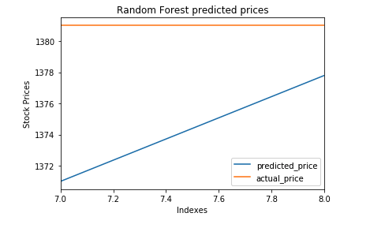
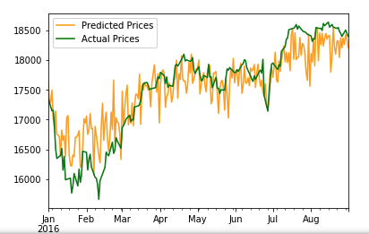

# Predicting Stock Prices with twitter Sentimental Analysis

This project uses **RandomForest**, **Linear Regression**, **MLPClassifier** and compares the accuracy of the prediction.

## How it works?
Step 1. Collect historical tweets about companies using twitter API based on hashtag. Ex ***#Apple***  
Step 2. Calculate the scores if its negative or positive using sentimental analysis for each tweet  
Step 3. Train the model using the tweets score for the day and stock price on that partcular day. ***Tweets score will be independent variable & Stock price will be dependent***.  
Step 4. Predict and test the accuracy of each model.  

## What's being done?
### Part 1: 
Step 1. I collect tweets using the API on Reliance Industries based on JIO hashtag for a week. 
Step 2. Get stock data for the week. 
Step 3. Tain the model and predict    
**Result :** As the data is too little to predict anything we couldn't get proper results. We coudn't collect more data due to the limitations of twitter API.  

### Part 2: 
Step 1. I found a prepared dataset of Apple stock prices with tweets. 
Step 2. Process he dataset. 
Step 3. Tain different models and predict using each model and compare accuracy scores.  
**Result :** RandomForest goves the best accuracy of 91% 

